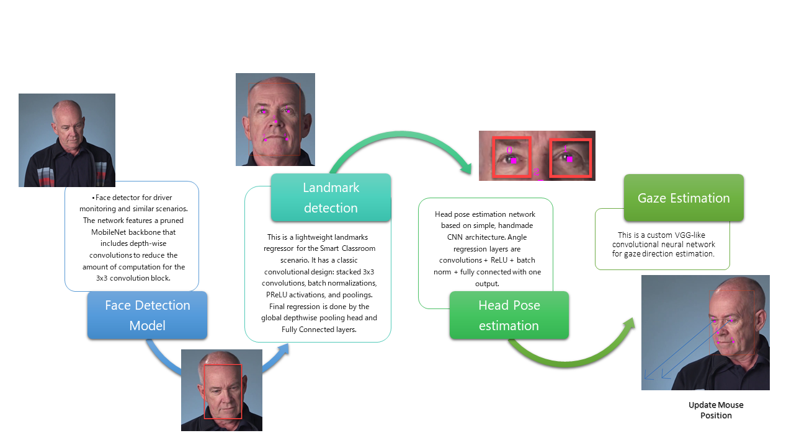
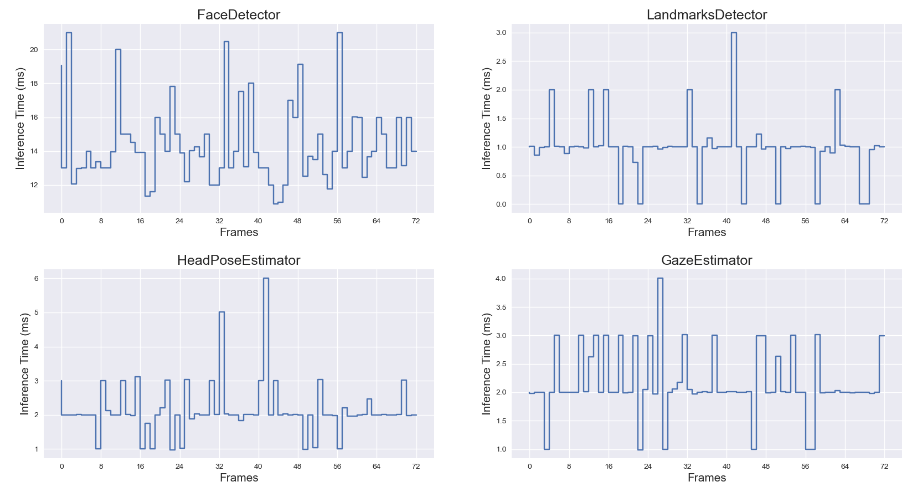
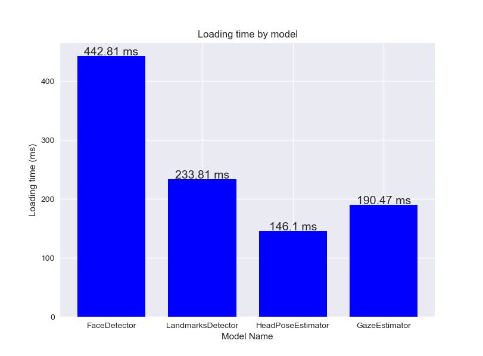
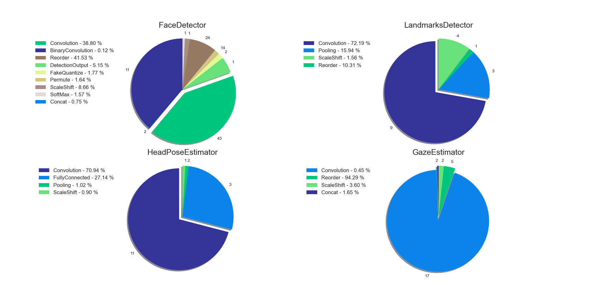
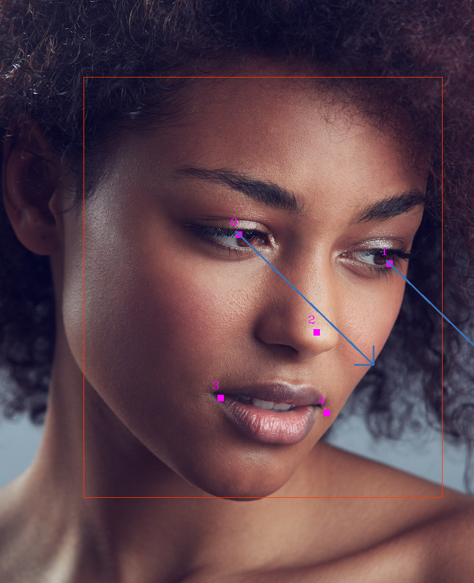

# Computer Pointer Controller

As a final project of the Udacity's **_Intel edge AI for IoT developers Nanodegree_**, this project consisted of building a deep learning pipeline(using multiple models from the OPENVINO zoo) to create an application that allows users to control the mouse pointer with the gaze of the user's eyes. The image below shows a snapshot of the complete pipeline.

### Workflow



## Project Set Up and Installation

### Setup environment

This installation assumes that some version of python has been previously installed

1. Download [OpenVINO ToolKit](https://docs.openvinotoolkit.org/) and install it locally.
2. Install the dependencies:
````
pip install matplotlib
pip install numpy
pip install opencv-contrib-python
pip install mouse
````    
3. Clone this repository
````shell script
git clone https://github.com/haruiz/Computer-Pointer-Controller.git
````
4. Initialize OpenVINO enviroment

> Linux
````shell script
source /opt/intel/openvino/bin/setupvars.sh
````
> windows
````shell script
cd C:\Program Files (x86)\IntelSWTools\openvino\bin\
setupvars.bat
````
5. Download models

````shell script
python ./src/download_model.py
````  

### Directory Structure


- **bin** Media and test files
- **assets** README.md assets
- **models.txt** This file is used by the [download_models.py](https://github.com/haruiz/Computer-Pointer-Controller/blob/master/src/download_models.py) script to download the openVINO model from the zoo
- **.gitignore** list of paths that should be ignored by GitHub
- **README.md** File you are reading
- **src folder:** folder contains python files of the app

File  | Description
 ------------- | -------------
 [app.py](https://github.com/haruiz/Computer-Pointer-Controller/blob/master/src/app.py) | Application endpoint, here is where everything start, so this is the file that should bu run first
 [download_models.py](https://github.com/haruiz/Computer-Pointer-Controller/blob/master/src/download_models.py) | Util Script to download models from the OpenVINO zoo to the project folder (it creates a folder 'models') 
 [model.py](https://github.com/haruiz/Computer-Pointer-Controller/blob/master/src/model.py) | Base Class to load and run inference for any OpenVINO Model
 [face_detector.py](https://github.com/haruiz/Computer-Pointer-Controller/blob/master/src/face_detector.py) | This class inherit from the Model class and has all the code related to the face detection Model inference 
 [gaze_estimator.py](https://github.com/haruiz/Computer-Pointer-Controller/blob/master/src/gaze_estimator.py) | This class inherit from the Model class and has all the code related to the gaze estimation Model inference
 [head_pose_estimator.py](https://github.com/haruiz/Computer-Pointer-Controller/blob/master/src/head_pose_estimator.py) | This class inherit from the Model class and has all the code related to the head pose estimation Model inference
 [landmarks_detector.py](https://github.com/haruiz/Computer-Pointer-Controller/blob/master/src/landmarks_detector.py) | This class inherit from the Model class and has all the code related to the landmarks detection Model inference
 [pipeline.py](https://github.com/haruiz/Computer-Pointer-Controller/blob/master/src/pipeline.py) | The Pipeline is an abstract class which contains a generator function which by default pass our data (from the previous generator in the pipeline) through filter function and map function. The filter function allows us to filter the data passing our pipeline. The map function gives us the possibility to manipulate (map) the pipeline data or update the state of the step as in First class. By overriding an__or__ operator, it is possible to create Unix like pipeline
 [profiling.py](https://github.com/haruiz/Computer-Pointer-Controller/blob/master/src/profiling.py) | line profile instance 
 [timeit_decor.py](https://github.com/haruiz/Computer-Pointer-Controller/blob/master/src/timeit_decor.py) | Util decorator that is used for measuring the execution time of the "load model" and "predict" methods implemented in the Model class (model.py)
 [perf_count_decor.py](https://github.com/haruiz/Computer-Pointer-Controller/blob/master/src/timeit_decor.py) | Util decorator that is used for measuring the perform of the model after do predictions
 [util.py](https://github.com/haruiz/Computer-Pointer-Controller/blob/master/src/util.py) | Processing, and profiling util functions
 
## Demo

Run application
````shell script
python ./src/app.py
````
  

## Documentation (How it works?)
Taking the inspiration from this amazing post [Video processing pipeline with OpenCV](https://medium.com/deepvisionguru/video-processing-pipeline-with-opencv-ac10187d75b), the implementation of this application was made using python generators, so within the app.py file all the operations of the complete pipeline are defined(feed_data -> detect_faces -> detect_landmarks -> estimate_head_pose -> estimate_gaze -> visualize_result ). How this works is basically passing the individual images fetched for the generator, into the steps defined in the pipeline applying different operations. This strategy is similar to the form used by the functional programming paradigm where you can chain or stack multiple functions. The first step of the pipeline must generate our input data, so in this case can be the frames read from a video, the camera a or just a static image.
  

## Benchmarks

### Inference time (Including processing)

The figure below shows the inference time for each model. Given that the Face detector model makes the inference on the entire image, we can observe a big difference in comparison with the others; based on the chart, the model that performs faster is the LandmarksDetector.



### Loading time



### Perf Counts (CPU time)

In this chart, we can notice that during the inference, the task that takes more CPU time is performing the convolutions. Additionally, we can also observe that the face detector seems to the more complex based on the number of layers.



### Results

Single Image  | Video (click in the video)
 ------------- | -------------
    | <a href="https://youtu.be/nyCAGHRU_AA" target="_blank"></a>

### Edge Cases

- If more than one person is detected in the image, the face detection model picks only the first one.
- Using the mouse library decreases the FPS on the application drastically; In the future, I would like to evaluate if it is possible to manipulate the mouse in another thread.  